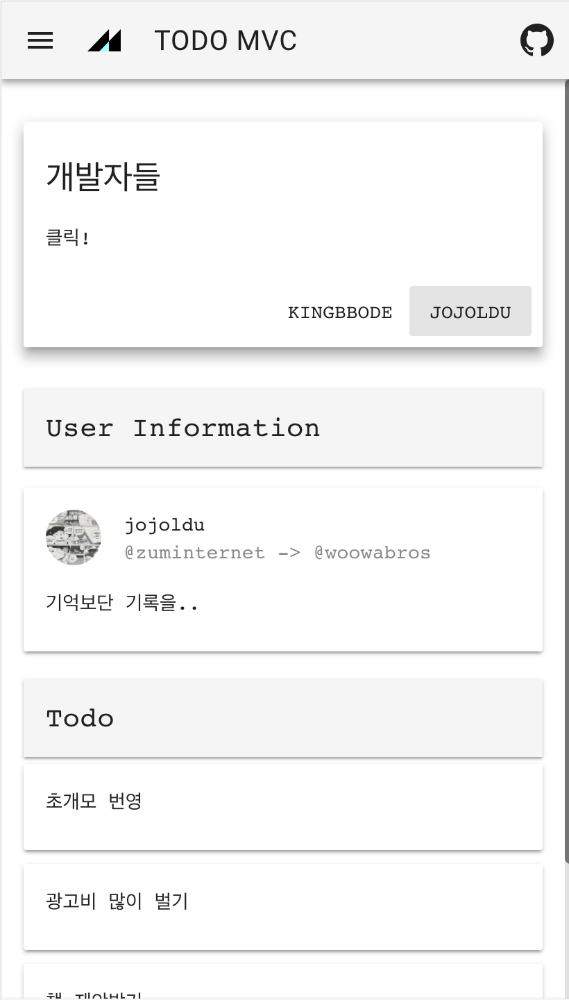
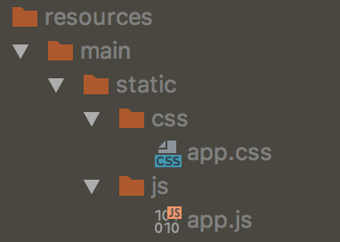

# Spring + Vue.js

스프링과 뷰가 어떻게 한 프로젝트 안에서 동작할 수 있을지 잡아본 구조이다. (꼭 Vue가 아니더라도, 어떠한 Frontend 라도 관계없다)


 
`Spring`과 `Vue.js`를 한 프로젝트 안에서 개발하는 간단한 예제 프로젝트! 

이지만, 사실 떨어져 있어도 상관없을 만큼 관계가 없다. 그러니 개발은 각각 `Spring`, `Vue.js` 를 하면 된다.

중요한 것은 한 어플리케이션에서 효율적으로 개발하기 위한 환경일 것이다.

## Webpack

> Vue Cli 를 통해 설치하면 더 안정적인 Webpack 설정을 얻을 수 있다. 하지만 지극히 Front End 위주적인 환경을 제공해주기도 하고,
이 프로젝트에서 필요한 양 이상의 설정이 더욱 복잡함을 가중시켜, 약 1년 전 설정했던 Webpack 설정을 그대로 사용했다.

- 한 프로젝트에 있지만, 철저히 분리해야 복잡도를 줄일 수 있다. 그래서 src 하위에 front 라는 디렉토리를 만들고 그곳에서 모든 프론트엔드 관련 작업을 하도록 한다. (폴더 구조는 선호하는 구조로 잡으면 된다.)
    - 빌드 시 불필요한 파일(번들되기 전 파일, 미사용 이미지 등)이 같이 패키징 되는 더러운 상황과, 이를 방지하기 위해 빌드 전 resource directory 에 불필요한 파일을 매번 삭제해야하는 불필요한 행위를 줄여줄 수 있다.
    
- Webpack 의 bundle 최종 경로가, Spring 의 resource static path 를 향하도록 한다. 
    - 최종 bundle 된 파일을 다시 copy 하는 불필요한 행위를 줄여줄 수 있다. 
    - webpack devServer 환경과 함께 사용하면, 스프링에서는 동일한 로직으로 운영, 개발 등 환경을 운영할 수 있다. (Backend Template 에서 js, css 등의 파일명을 교체하거나 경로를 조작하는 불필요한 행위를 줄여줄 수 있다.)

```js
    entry: {
        app: path.resolve(__dirname, 'src/front/main.js')
    },
    output: {
        path: path.resolve(__dirname, 'src/main/resources/static')
        ...
    }
```    
    
## 개발

두번 실행하는게 귀찮지만, 비교적 간단하다.

1. Spring WebApplication 을 구동한다.

2. 터미널에서 `npm run start` 를 실행하여 webpack devServer 를 구동한다.
    
- 이 프로젝트의 `package.json` 에는 webpack 을 구동하는 script 를 선언해두었다. `start` 명령도 그 중 하나이다.
    - start : webpack devServer 구동
    - dev : 개발 환경 webpack - 압축, 난독화되지 않은 번들 파일 생성.
    - build : 운영 환경 webpack - 압축, 난독화된 번들 파일 생성.

3. spring devtools 와 webpack devServer 환경에서 양쪽을 오가며 실시간으로 개발을 한다.

## 빌드

배포 또한 매우 단순하다. 

gradle 에서 npm 명령을 사용할 수 있는 플로그인을 사용하여, build 환경의 webpack 을 실행시켜주는 Task 를 아래와 같이 간단히 만들 수 있다.

그리고 build 과정 중 resources 를 생성하는 순서 앞에 끼어넣어준다. 

webpack의 bundle이 자동으로 `Spring` 의 `resources path` 하위에 파일을 넣어주므로, 추가적인 것은 필요없다. 


```
task webpack(type: NpmTask, dependsOn: 'npmInstall') {
	args = ['run', 'build']
}

processResources.dependsOn 'webpack'
```

아무 특별한 것 없이 `gradle` 의 `build task` 를 실행하면 된다.

그러면 build 된 jar 파일 안에 static 파일들이 잘 옮겨진 것을 볼 수 있다.

